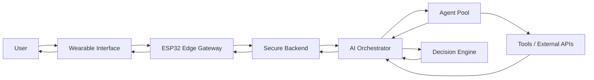
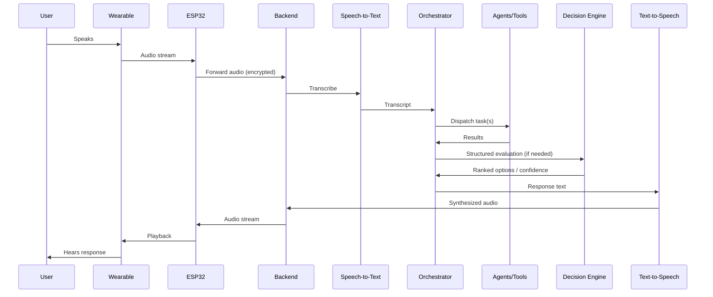
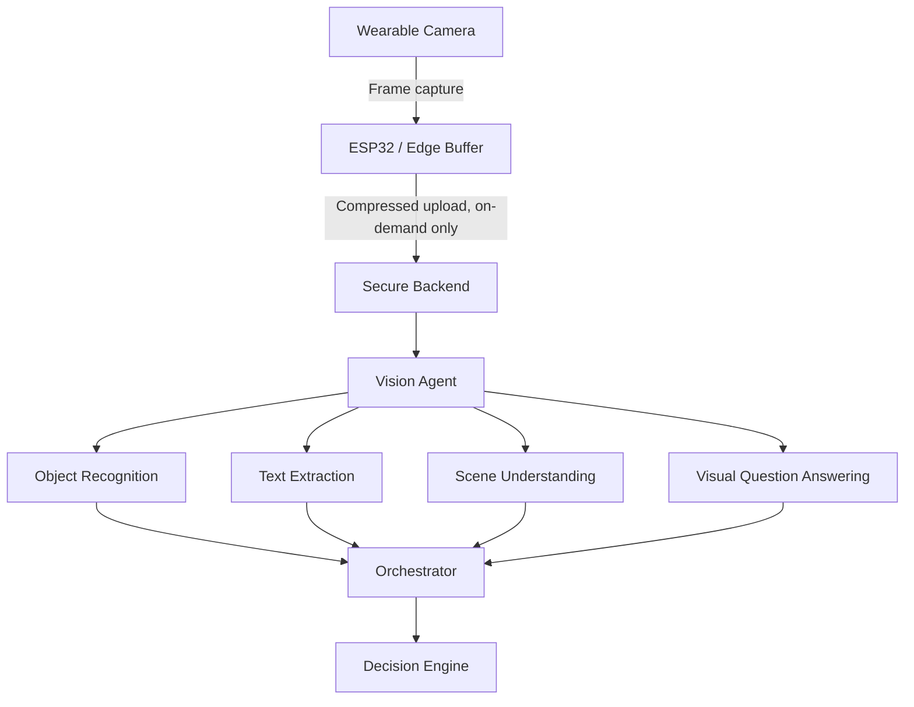
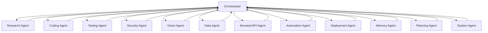
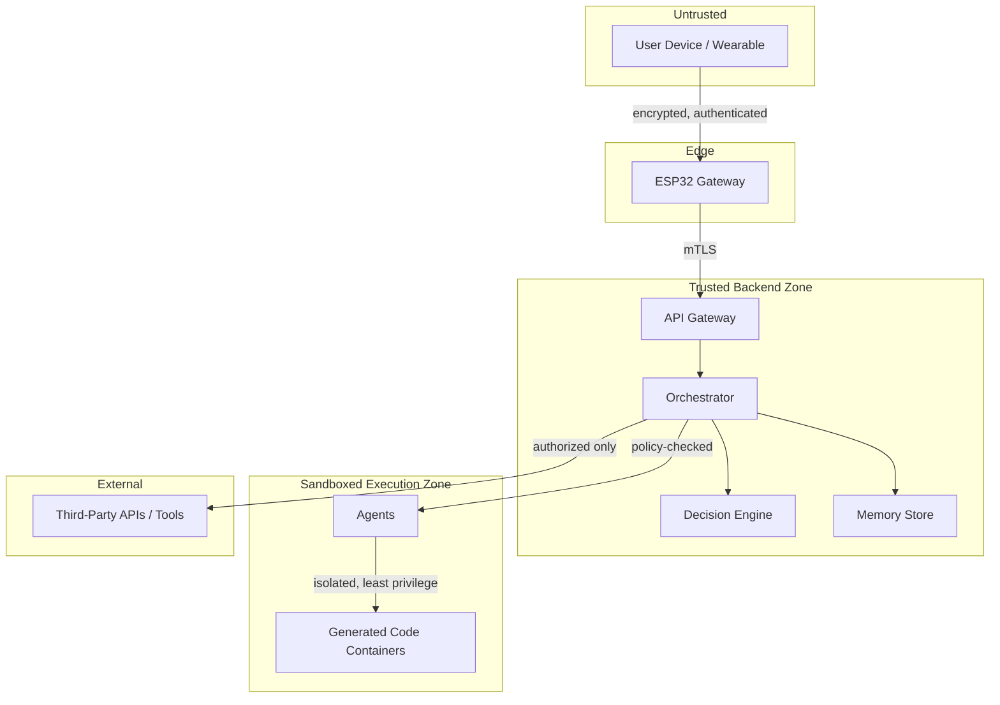
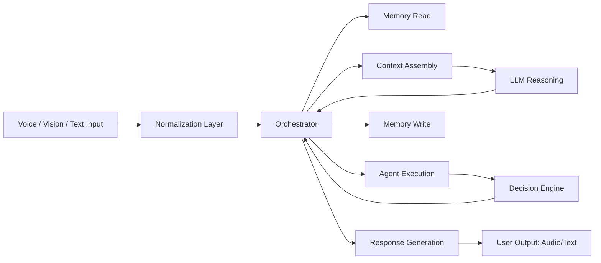

# 669px AI

**A personal AI operating system providing a persistent, multimodal, voice-first interface between a user and their digital and physical environment.**

---

## Status Legend

Every capability in this document is tagged with one of:

| Tag | Meaning |
|---|---|
| `Implemented` | Exists in the codebase and is usable today |
| `In Development` | Actively being built, partially working |
| `Experimental` | Prototyped, unstable, API/behavior not finalized |
| `Planned` | Designed, not yet started |

Nothing in this repository should be assumed to work unless marked `Implemented`. This document describes target architecture for a system currently in the design and early-build phase.

---

## Overview

669px AI is not a chatbot wrapper. It is an orchestration layer that sits between a user, one or more LLM providers, a persistent memory store, a set of specialized agents, and the external tools and data sources those agents need to act on the user's behalf.

The primary interaction surface is voice, delivered through wireless earbuds and wearable hardware, with optional vision input from a wearable camera. Behind that interface, the system separates reasoning (LLM), computation (decision engine), state (memory), and execution (agents/tools) into independent, replaceable components.

## Vision

The long-term goal is an intelligent operating layer that:

- Understands spoken requests in context, without requiring rigid command syntax
- Maintains memory of the user's preferences, ongoing work, and history, under the user's control
- Delegates work to specialized agents rather than trying to do everything in one model call
- Combines LLM reasoning with deterministic computation where precision matters
- Extends its own capabilities in a controlled, auditable, reversible way
- Treats security and user consent as non-negotiable, not bolted on afterward

669px AI does not attempt to be omniscient. It makes calculated recommendations with explicit confidence and uncertainty, asks for clarification when it doesn't have enough information, and defers to the user on anything risky or irreversible.

## Core Capabilities

| Capability | Status |
|---|---|
| Voice interaction (STT/TTS pipeline) | Planned |
| Wearable camera / vision pipeline | Planned |
| Persistent, user-controlled memory | Planned |
| Real-time data integration (maps, weather, calendar, etc.) | Planned |
| Deterministic decision engine | Planned |
| Multi-agent orchestration | Planned |
| Automation / tool & API integration | Planned |
| Code generation for new capabilities | Planned |
| Isolated testing of generated code | Planned |
| Plugin packaging and registration | Planned |
| Controlled self-extension | Experimental (design only) |
| Sandboxed / policy-gated deployment | Planned |
| Continuous improvement via feedback loops | Planned |

## Architecture

669px AI is organized around a single principle: **the LLM is one component, not the system.** Reasoning, memory, computation, execution, and security are separate subsystems that communicate through defined interfaces, so any one of them (including the model provider) can be replaced without a rewrite.

```
User → Wearable Interface → ESP32 → Secure Backend → AI Orchestrator → Agents → Tools/APIs → Decision Engine → Response
```

The ESP32 layer is intentionally thin. It is an edge gateway for audio/video capture and transport, not a compute node. All reasoning, memory, and heavy computation happen on the backend (self-hosted or cloud).

### High-Level System Diagram



Additional diagrams for each subsystem (voice, vision, agents, self-extension, security, data flow) are included in their respective sections below.

### System Components

| Component | Responsibility |
|---|---|
| Wearable Interface | Captures audio/video, plays back audio, minimal local buffering |
| ESP32 Edge Gateway | Device pairing, transport (BLE/Wi-Fi), stream forwarding, no AI inference |
| Secure Backend | Authentication, TLS termination, request routing, rate limiting |
| AI Orchestrator | Parses intent, assembles context, dispatches to agents/decision engine, assembles responses |
| LLM Adapter | Provider-agnostic interface to external LLM APIs |
| Decision Engine | Deterministic computation, ranking, optimization, confidence scoring |
| Memory Store | Persistent, encrypted, user-inspectable context storage |
| Agent Pool | Specialized workers for research, coding, testing, security, vision, etc. |
| Tool/API Layer | Authorized integrations with external services |
| Security Subsystem | Auth, RBAC, sandboxing, audit logging, policy enforcement |
| Sandbox Runtime | Isolated execution environment for generated/untrusted code |

## Hardware

| Component | Role | Status |
|---|---|---|
| ESP32 / ESP32-S3 | Edge gateway, audio/video transport | Planned |
| Microphone (wearable) | Voice capture | Planned |
| Earbuds | Audio output, optional voice capture | Planned |
| Camera (wearable) | Optional vision input | Planned |
| Smartwatch / other wearables | Secondary input/output, notifications | Planned |
| Wi-Fi / Bluetooth | Transport | Planned |

The hardware layer is modular by design: any device that can produce an audio/video stream and consume an audio/text response can be integrated without redesigning the backend. New device types are added as transport adapters, not as changes to the orchestrator.

## Voice Pipeline

**Status: Planned**

1. User speaks.
2. Wearable captures audio.
3. ESP32 (or the wearable directly) transmits the audio stream to the backend.
4. Backend performs speech-to-text.
5. Orchestrator interprets the transcript and determines required actions.
6. Agents and tools execute those actions.
7. Decision engine evaluates structured data where precision or ranking is required.
8. Orchestrator assembles a response.
9. Text-to-speech converts the response to audio.
10. Audio is streamed back to the user's earbuds.

Low-latency transport (streaming STT, chunked TTS playback) is a design goal, not a guarantee — actual latency depends on network conditions, provider response time, and agent execution time, and will be reported, not assumed.



## Vision Pipeline

**Status: Planned**

Optional wearable camera integration can contribute:

- Object recognition
- Text extraction (OCR)
- Scene understanding
- Visual question answering
- Environmental context for other agents
- Visual navigation context
- Fusion of visual context with voice instructions



Vision introduces constraints that voice alone does not:

- **Privacy**: camera capture is opt-in and scoped; frames are processed and discarded by default rather than retained, and any retention requires an explicit user-set policy.
- **Bandwidth**: continuous video streaming is avoided; capture is event- or request-triggered where possible.
- **Latency**: vision inference is generally heavier than STT/TTS and is expected to add measurable delay, particularly for scene understanding.
- **Storage**: any stored frames or derived embeddings fall under the same memory retention and deletion policies as other memory data.
- **Compute**: object recognition and OCR can often run on lighter models than scene understanding or VQA, and the vision agent should route accordingly rather than always invoking the largest model available.

## LLM Architecture

**Status: Planned**

669px AI treats the LLM as a replaceable reasoning component behind a provider-agnostic adapter, not as the system itself. The following are kept as separate subsystems so that a model or provider swap does not require touching them:

- LLM reasoning (the adapter boundary)
- Deterministic computation (decision engine)
- Decision making / policy enforcement
- Memory (read/write, independent of any model's context window)
- Tool execution
- Agent orchestration
- Security and authentication
- State management

The LLM adapter exposes a single internal interface (prompt/context in, structured response out) regardless of which provider is behind it. Swapping providers means implementing that interface, not modifying the orchestrator.

## Memory

**Status: Planned**

Memory is external to the LLM. It is not implemented as continuous retraining or fine-tuning; it is a queryable, versioned store that is read into context at request time and written to based on explicit or inferred durable facts.

Memory can hold:

- User preferences
- User-defined instructions
- Important context and ongoing work
- Prior interactions
- Workflows and frequently used actions
- Other long-term relevant information

Required controls:

| Control | Description |
|---|---|
| Inspection | User can view exactly what is stored |
| Editing | User can correct or amend entries |
| Deletion | User can remove individual entries or entire categories |
| Retention policy | Explicit rules for how long data is kept and when it expires |
| Encryption | Data encrypted at rest and in transit |
| Access control | Memory access is scoped per-agent; agents receive only what they need for a given task |
| Ownership | The user, not any agent or third party, is the authoritative owner of stored data |

## Decision Engine

**Status: Planned**

The decision engine is a deterministic layer, separate from the LLM, for anything that benefits from being calculated rather than guessed. It handles:

- Structured data processing
- Constraint evaluation
- Cost calculations
- Probability estimation
- Alternative comparison and ranking
- Optimization
- Uncertainty estimation and confidence scoring

Example: comparing two routes considers distance, current traffic, estimated travel time, road conditions, historical patterns, weather, user preferences, and any other available constraints, then returns a ranked recommendation with an explicit confidence value — not a single "correct" answer presented as certain.

The LLM is not asked to perform this kind of calculation itself; it consumes the decision engine's output and explains it in natural language.

## Multi-Agent System

**Status: Planned**

The orchestrator delegates work to specialized agents, each with a narrow responsibility and a defined interface. Agents run independently and can execute concurrently.

| Agent | Responsibility |
|---|---|
| Research Agent | Information gathering, synthesis |
| Coding Agent | Code generation and modification |
| Testing Agent | Test authoring and execution |
| Security Agent | Static/dynamic security analysis, policy checks |
| Vision Agent | Camera-derived context (see Vision Pipeline) |
| Data Agent | Data processing, transformation, analysis |
| Browser/API Agent | Interaction with external web services and APIs |
| Automation Agent | Scheduled/triggered task execution |
| Deployment Agent | Packaging and shipping approved changes |
| Memory Agent | Memory read/write, retention enforcement |
| Planning Agent | Task decomposition, sequencing |
| System Agent | Health checks, resource management |



## Self-Extension Architecture

**Status: Experimental (design only)**

669px AI is designed to support controlled creation of new capabilities in response to a user request such as "create a feature that monitors X," without giving generated code unrestricted access to production.

```mermaid
flowchart LR
    REQ[User Requirement] --> AN[Requirement Analysis]
    AN --> GEN[Code Generation]
    GEN --> ISO[Isolated Environment]
    ISO --> DEP[Install Dependencies]
    DEP --> TEST[Automated Tests]
    TEST --> STAT[Static Analysis]
    STAT --> SEC[Security Checks]
    SEC --> INT[Integration Tests]
    INT -->|fail| FIX[Analyze & Fix]
    FIX --> TEST
    INT -->|pass| PKG[Package as Plugin]
    PKG --> POL[Deployment Policy Check]
    POL -->|authorized| DPL[Deploy]
    POL -->|denied| HOLD[Hold for Human Review]
    DPL --> REG[Register Capability]
    REG --> VER[Version History]
    VER -->|issue detected| RB[Rollback]
```



Controls enforced at every stage: sandboxing, least privilege, container isolation, network restrictions, versioning, audit logs, policy enforcement, and rollback capability. A generated feature is never deployed to production without passing every gate in this pipeline and, depending on configured autonomy level, explicit human approval.

## Autonomous Engineering Pipeline

**Status: Planned**

A dedicated engineering agent is responsible for extending the system itself:

- Requirement analysis
- Architecture generation
- Code generation
- Container creation
- Dependency management
- Testing and debugging
- Static and security analysis
- Integration testing
- Packaging
- Deployment
- Rollback

Configurable autonomy levels:

| Level | Behavior |
|---|---|
| Manual | Every step requires explicit user approval |
| Assisted | System proposes changes; user approves before execution |
| Auto-approved (low-risk) | Pre-classified low-risk changes execute without prompting; everything else requires approval |
| Fully autonomous (bounded) | System operates within pre-defined boundaries (e.g. no production DB schema changes, no new external network egress) without per-change approval |

Passing automated tests is treated as evidence of absence of known defects at the time of testing — not proof of correctness. Test coverage, static analysis results, and known limitations are reported alongside any deployment, not hidden behind a pass/fail flag.

## Security Architecture

**Status: Planned**

Security is treated as a first-class subsystem, not an afterthought layered on top of working features.



Required controls:

- Voice authentication and speaker verification (as a supporting factor, not the sole gate for sensitive actions)
- Device authentication
- Encryption in transit and at rest
- Secure API communication (mTLS or equivalent)
- Secrets management (no hardcoded credentials, ever)
- Capability-based permissions and role-based access control
- Agent isolation and container sandboxing
- Network policy enforcement (default-deny egress for sandboxed code)
- Audit logging for all privileged actions
- Rate limiting and replay protection
- Prompt injection defenses (input sanitization, provenance tracking, tool-call gating)
- Explicit tool authorization per agent, per task
- Human confirmation required for high-risk or irreversible operations
- Emergency shutdown path
- Rollback for any deployed change
- Secure update mechanism for firmware and backend components

**Voice recognition alone is never sufficient authentication for sensitive actions** (financial transactions, data deletion, credential changes, deployment approval). These require a second factor.

## Permission System

**Status: Planned**

Permissions are capability-based: an agent is granted only the specific tool calls and data scopes it needs for a given task, for the duration of that task, not standing access to everything the system can do.

- Role-based access control governs which agents/users can invoke which capabilities.
- High-risk actions (deletion, financial operations, production deployment, external communication on the user's behalf) require explicit human confirmation regardless of autonomy level.
- All permission grants and uses are logged and inspectable.
- Permissions are revocable at runtime without requiring a redeploy.

## Repository Structure

```
669px-ai/
├── apps/
│   ├── voice-client/          # Wearable-facing client application
│   ├── mobile-companion/      # Configuration, memory inspection, controls
│   └── admin-dashboard/       # Operator/observability UI
├── services/
│   ├── orchestrator/          # Core request routing and response assembly
│   ├── stt-gateway/           # Speech-to-text service wrapper
│   ├── tts-gateway/           # Text-to-speech service wrapper
│   └── api-gateway/           # External-facing auth, routing, rate limiting
├── agents/
│   ├── research/
│   ├── coding/
│   ├── testing/
│   ├── security/
│   ├── vision/
│   ├── data/
│   ├── browser-api/
│   ├── automation/
│   ├── deployment/
│   ├── memory/
│   ├── planning/
│   └── system/
├── core/
│   ├── llm-adapter/           # Provider-agnostic LLM interface
│   ├── agent-protocol/        # Shared agent communication contract
│   ├── state-manager/         # Session/task state, independent of memory store
│   └── auth/                  # Authentication primitives
├── memory/
│   ├── store/                 # Persistent memory backend
│   ├── retention/             # Retention policy enforcement
│   └── access-control/        # Per-agent memory scoping
├── decision-engine/
│   ├── constraints/
│   ├── optimization/
│   └── confidence/
├── voice/
│   ├── stt/
│   ├── tts/
│   └── speaker-verification/
├── vision/
│   ├── object-recognition/
│   ├── ocr/
│   └── scene-understanding/
├── hardware/
│   ├── esp32-firmware/
│   ├── esp32-s3-firmware/
│   └── ble-gateway/
├── plugins/
│   ├── registry/               # Installed/available plugin metadata
│   └── examples/
├── tools/
│   ├── integrations/           # Maps, weather, calendar, IoT, etc.
│   └── schemas/                # Tool call contracts
├── sandbox/
│   ├── runners/                # Isolated execution environments
│   └── policies/               # Network/resource policy definitions
├── security/
│   ├── auth/
│   ├── rbac/
│   ├── audit/
│   └── prompt-injection-defenses/
├── tests/
│   ├── unit/
│   ├── integration/
│   └── e2e/
├── infrastructure/
│   ├── docker/
│   ├── terraform/
│   └── ci-cd/
└── docs/
    ├── architecture/
    └── adr/                    # Architecture decision records
```

## Data Flow



## Example Interactions

These illustrate intended behavior, not current functionality.

> **User:** "What's the fastest way to the airport right now?"
> **System:** "Route via the highway is currently 34 minutes, moderate confidence due to an accident report 10 minutes old. The surface-street route is 41 minutes but more predictable. Want the highway route?"

> **User:** "Delete last week's meeting notes."
> **System:** "This will permanently delete 4 memory entries from March 10–14. Confirm deletion?"

> **User:** "Set up a monitor for our API error rate."
> **System:** "I don't have access to your API's monitoring provider yet. Which service do you use — Datadog, Grafana, or something else?"

## Configuration

**Status: Planned**

Target configuration model (subject to change before implementation):

- A root `config.yaml` for orchestrator, agent, and decision-engine settings
- `.env` for secrets and provider credentials (never committed; loaded via a secrets manager in production)
- Per-agent capability manifests declaring required tool scopes
- A provider registry mapping logical LLM roles to concrete provider/model configuration, so swapping providers is a config change, not a code change

## Development Setup

**Status: Planned**

Once the initial services exist, expected local development will involve:

1. Cloning the repository
2. Running backend services via `infrastructure/docker`
3. Providing LLM provider credentials via `.env`
4. Running the test suite before making changes
5. Using the mobile companion app or admin dashboard for local memory inspection

This section will be replaced with exact commands once `services/orchestrator` and `infrastructure/docker` are implemented.

## Deployment

**Status: Planned**

Target model: containerized services behind the API gateway, deployed via CI/CD with policy gates from the self-extension pipeline applied to any change — including changes made by the system itself. Firmware updates for ESP32 devices are signed and delivered through a secure update channel.

## Testing

**Status: Planned**

- Unit tests per service/agent
- Integration tests across orchestrator ↔ agent ↔ decision-engine boundaries
- End-to-end tests simulating full voice/vision request cycles
- Security-focused tests: prompt injection attempts, permission-boundary violations, sandbox escape attempts

Test results are reported with coverage and known gaps — passing tests are not represented as proof of correctness.

## Observability

**Status: Planned**

- Structured logging across all services
- Distributed tracing for cross-agent request flows
- Audit log for all privileged actions and permission grants
- Latency and confidence-score metrics per response, to make system uncertainty visible rather than hidden

## Roadmap

| Phase | Focus | Status |
|---|---|---|
| 0 | Core orchestrator, LLM adapter, basic memory store | Planned |
| 1 | Voice pipeline (STT/TTS), single-agent tool use | Planned |
| 2 | Multi-agent orchestration, decision engine | Planned |
| 3 | Vision pipeline | Planned |
| 4 | Sandbox runtime, self-extension pipeline (experimental) | Planned |
| 5 | Hardware integration (ESP32 firmware, wearables) | Planned |
| 6 | Autonomous engineering agent, configurable autonomy levels | Planned |

## Limitations

- The decision engine improves the quality of comparisons and estimates; it does not eliminate uncertainty, and confidence scores reflect the engine's inputs, not ground truth.
- Vision and voice processing both carry real latency and compute cost; low-latency is a target, not a guarantee.
- Self-extension is inherently higher-risk than static software; it is gated behind sandboxing and policy checks, but no sandbox is a substitute for review of anything given elevated autonomy.
- LLM outputs can be wrong or inconsistent regardless of the surrounding architecture; the decision engine and agent structure reduce but do not remove this risk.
- This system does not predict the future; real-time data and ranked recommendations are estimates based on available information at request time.

## Privacy

- Memory, voice, and vision data belong to the user and are stored under explicit retention policies the user controls.
- Camera data defaults to process-and-discard rather than retention.
- No data is shared with third-party tools/APIs except when a specific agent action requires it, and only with the scope necessary for that action.
- Users can inspect, edit, and delete stored data at any time.

## Security Considerations

- Treat every wearable-to-backend link as a potential attack surface; authenticate and encrypt it.
- Treat generated code as untrusted by default, regardless of which agent produced it.
- Voice is a convenient interface, not a secure one — pair it with a second factor for sensitive actions.
- Any autonomy level above "Manual" increases blast radius if a policy gate is misconfigured; boundaries should be reviewed before being loosened.

## Contributing

Contribution guidelines will be added as the initial architecture stabilizes. Until then, issues and design discussion are welcome; large PRs against unstable interfaces (orchestrator, agent protocol) are likely to require rework.

## License

License to be determined. Add your chosen license (e.g. MIT, Apache-2.0) here before publishing.
